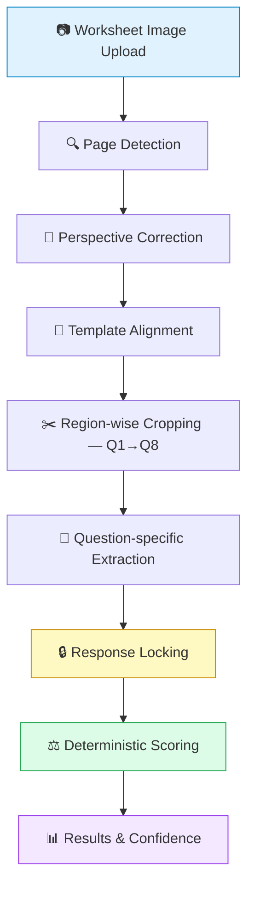

<div align="center">

# 📝 Student Worksheet Automated Marking System

### *An extraction-first, bias-resistant pipeline for grading handwritten Grade 2–3 worksheets*

[](https://www.python.org/)
[](https://fastapi.tiangolo.com/)
[](https://react.dev/)
[](https://vitejs.dev/)
[](https://opencv.org/)

[]()
[]()
[](https://www.multifold.ai)

</div>

---

## 🎯 Core Principle

> **Extraction and scoring are two separate problems.** The system always asks *"what did the student actually write?"* before it ever asks *"was it correct?"*

```
✍️  Student marks B  →  👁️  Visual Extraction  →  🔒  "B" Locked  →  📊  Compare vs Answer Key  →  ✅/❌
```

**Observe → Lock → Score.** Once a response is locked, it is *never* revised based on what the "correct" answer should be.

> [!IMPORTANT]
> This design exists to prevent **over-correction** — a documented failure mode where vision-language models silently replace a student's wrong answer with the mathematically expected one. No extraction step ever sees the answer key. Scoring is a separate, fully deterministic, rule-based comparison — zero ML involved.

---

## 🔄 Pipeline Overview



---

## 🛠️ Tech Stack

<div align="center">

| Layer | Technology | Purpose |
|:---:|:---:|---|
| 🎨 Frontend | `React 19` | Worksheet upload & results interface |
| ⚡ Tooling | `Vite` | Dev/build environment |
| ⚙️ Backend | `Python 3.10` + `FastAPI` | API & pipeline orchestration |
| 🚀 Server | `Uvicorn` | Serving the FastAPI app |
| 👁️ Vision | `OpenCV` | Page detection, thresholding, feature extraction |
| 🔢 Numerical | `NumPy` | Image-array operations |
| 🖼️ Imaging | `OpenCV` / `Pillow` | Image loading & preprocessing |
| ✅ Validation | `Pydantic` | API/data validation |
| 📄 Config | `JSON` | Region definitions & answer keys |
| 🧭 Matching | `ORB` + `BFMatcher` | Feature-based template alignment |
| 🧪 Testing | `pytest` | Backend test suite |
| 🤖 VLM (planned) | `Gemini Flash` | Fallback extraction, region-only, no answer key |

</div>

---

## 📋 Question-wise Extraction Strategy *(week_07 template)*

| Questions | Type | Method |
|:---:|---|---|
| `Q1–Q6` | 🔲 MCQ | OpenCV checkbox/mark detection |
| `Q7` | ✏️ Handwritten numeral | Dedicated digit-recognition model |
| `Q8` | 🔣 Comparison symbol | Dedicated `<` `>` `=` classifier |

### 🔲 MCQ Detection — Classical CV, No ML

```
Grayscale → Adaptive Threshold → Option Segmentation → Fill-Ratio Analysis → Selection
```

Handles `BLANK` · `MULTIPLE` · `STRAY_MARK` · `AMBIGUOUS` — fully interpretable, fully deterministic.

### ✏️ Handwriting / VLM Path

```
Cropped Region → Preprocessing → Handwriting/VLM Recognition → 🔒 Locked → ⚖️ Scored
```

Any VLM fallback call is **region-only** — it never receives the answer key.

---

## 🗂️ Template Architecture

```
backend/templates/week_07/
├── 🖼️  template_image.jpg   → reference layout for alignment
├── 📍 regions.json          → location + type of each answer region
└── 🔑 answer_key.json       → expected answer per region
```

New worksheets plug in as new template folders — zero pipeline restructuring.

---

## 📁 Repository Structure

```
📦 Student_worksheet_marking_multifold
├── 🔧 backend/
│   ├── pipeline/
│   │   ├── preprocessing/   # page detection, perspective correction, alignment
│   │   ├── extraction/      # one module per response type
│   │   └── scoring/         # deterministic comparison — no ML
│   ├── templates/            # per-worksheet configs
│   ├── api/                  # FastAPI app
│   ├── benchmark/             # accuracy/latency/cost harness
│   ├── tests/
│   └── requirements.txt
│
└── 🎨 frontend/
    # React 19 + Vite — talks to backend via API only
```

> Frontend and backend are kept **fully separate** — no shared source files, no shared config.

---

## 📊 Current Status

<table>
<tr>
<td valign="top" width="50%">

### ✅ Implemented
- React/Vite frontend
- FastAPI backend
- Worksheet upload API
- Page detection
- Perspective correction
- Template-based region config
- Initial MCQ extraction
- Deterministic scoring
- Question-wise results
- Confidence representation

</td>
<td valign="top" width="50%">

### 🚧 In Progress
- Robust template alignment
- Handwritten checkbox detection
- Handwritten numeral recognition
- Comparison-symbol recognition
- Devanagari handwriting/OCR
- Gemini/VLM fallback integration
- Ambiguity handling
- Accuracy benchmarking

</td>
</tr>
</table>

---

## 🚀 Getting Started

```bash
# ── Backend ──────────────────────────
cd backend
pip install -r requirements.txt
uvicorn api.main:app --reload

# ── Frontend ─────────────────────────
cd frontend
npm install
npm run dev
```

---

## 📈 Benchmark Metrics

| Metric | Why it matters |
|---|---|
| Extraction accuracy | Overall faithfulness of readings |
| 🚨 **False-correction rate** | Primary metric — a wrong answer silently "fixed" to the correct one |
| Blank-vs-faint accuracy | Distinguishing no answer from faint handwriting |
| Ambiguity handling | Uncertain cases correctly flagged, not guessed |
| MCQ accuracy | Including `MULTIPLE` / `BLANK` states |
| Latency | Per stage, per worksheet |
| Cost | Per worksheet at production volume |

---

<div align="center">

**License:** Proprietary — MultifoldAI internal project

*Built with 🧠 by the MultifoldAI engineering team*

</div>
